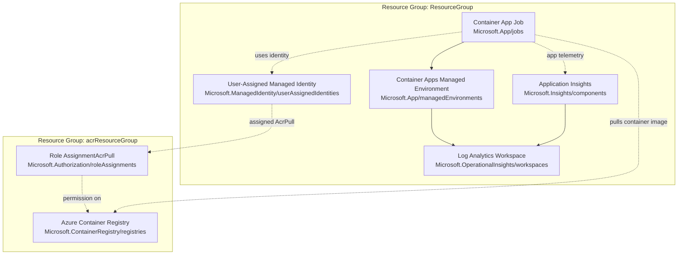

# Deployment Artifacts

## Azure Services Used

| Azure service/resource type | Description | Included in Bicep file(s) | Deployed resource group |
|---|---|---|---|
| Resource Groups (`Microsoft.Resources/resourceGroups`) | Creates the resource group containers for the platform resources and ACR resources. | `acr.bicep`, `prereqs.bicep` | `acrResourceGroup` and `acaResourceGroup` |
| Azure Container Registry (`Microsoft.ContainerRegistry/registries`) | Private container registry that stores images used by the Container App Jobs. | `acr.bicep` | `acrResourceGroup` |
| Role Assignment (`Microsoft.Authorization/roleAssignments`) | Grants `AcrPull` permission to the user-assigned managed identity on the ACR scope. | `prereqs.bicep` | `acrResourceGroup` |
| User-Assigned Managed Identity (`Microsoft.ManagedIdentity/userAssignedIdentities`) | Identity used by jobs to authenticate to ACR and for workload identity scenarios. | `prereqs.bicep` | `acaResourceGroup` |
| Log Analytics Workspace (`Microsoft.OperationalInsights/workspaces`) | Central log store for Container Apps environment logs and observability data. | `prereqs.bicep` | `acaResourceGroup` |
| Application Insights (`Microsoft.Insights/components`) | Application telemetry and monitoring for the worker jobs. | `prereqs.bicep` | `acaResourceGroup` |
| Container Apps Managed Environment (`Microsoft.App/managedEnvironments`) | Hosting environment for Container App Jobs and their runtime/logging configuration. | `prereqs.bicep` | `acaResourceGroup` |
| Container App Job (`Microsoft.App/jobs`) | Executes the manual/scheduled worker containers in Azure Container Apps Jobs. | `container-job.bicep` | `acaResourceGroup` |

## Deployment Topology

